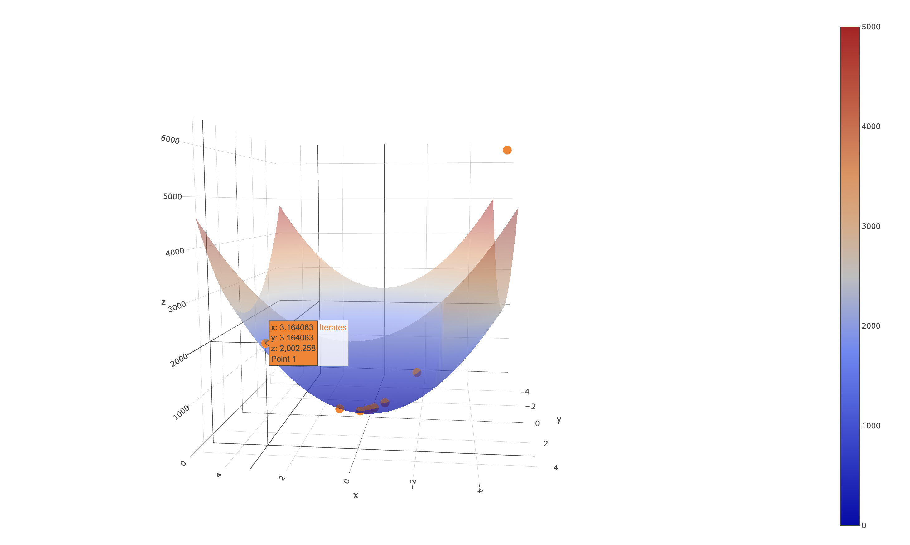

# Optimization-Solvers

Numerical optimization solvers for unconstrained and simple bound-constrained optimization problems. The solvers are implemented in Rust and are based on the ACM Collected Algorithms. The solvers are designed to be easy to use and to be easily integrated into existing codebases. 

> **Note:** Currently the unique non-rust solver is L-BFGS-B, which uses code bindings to the original Fortran implementation.

<!-- we include an image from the assets folder -->

# Todo
- Consider implementing solutions for [line search in constrained optimization](https://scicomp.stackexchange.com/questions/7938/line-search-for-constrained-optimization)
- Consider adding [preconditioning techniques]()

## Links
- ACM digital library: https://dl.acm.org/
- ACM Collected Algorithms: https://calgo.acm.org/
- IEEE Xplore: https://ieeexplore.ieee.org/Xplore/home.jsp

## Books and articles:
- GLL non-monotone line search algorithm: [L. Grippo, F. Lampariello and S. Lucidi, “A Nonmonotone Line Search Technique for Newton’s Methods,” SIAM Journal on Numerical Analysis, Vol. 23, No. 4, 1986, pp. 707-716.](https://epubs.siam.org/doi/10.1137/0723046)
- Misc. on numerical optimization: [Boyd, S., & Vandenberghe, L. (2004). Convex optimization. Cambridge university press.](https://web.stanford.edu/~boyd/cvxbook/) (Chapter 9)
- Misc. on numerical optimization: [Nocedal, J., & Wright, S. J. (2006). Numerical optimization. Springer Science & Business Media.](https://www.math.uci.edu/~qnie/Publications/NumericalOptimization.pdf) 
- Misc. on numerical optimization:[Neculai Andrei, 2022. "Modern Numerical Nonlinear Optimization," Springer Optimization and Its Applications, Springer, number 978-3-031-08720-2, December](https://link.springer.com/book/10.1007/978-3-031-08720-2)
- Misc. on numerical optimization + cubic and quadratic interpolation: [Sun, Wenyu & Yuan, Ya-xiang. (2006). Optimization theory and methods. Nonlinear programming](https://bayanbox.ir/view/1460469776013846613/Sun-Yuan-Optimization-theory.pdf)
- Moré-Thuente line search algorithm: [Jorge J. Moré and David J. Thuente. 1994. Line search algorithms with guaranteed sufficient decrease. ACM Trans. Math. Softw. 20, 3 (Sept. 1994), 286–307.](https://www.ii.uib.no/~lennart/drgrad/More1994.pdf)
- Survey of existing solvers for bound-constrained optimization: [Tröltzsch, A. (2007). Benchmarking of bound-constrained optimization software](https://www.cerfacs.fr/algor/reports/2007/WN_PA_07_143.pdf) 
- Survey of existing solvers for bound-constrained optimization: [Birgin, E.G., Gentil, J.M. Evaluating bound-constrained minimization software. Comput Optim Appl 53, 347–373 (2012)](https://www.ime.usp.br/%7Eegbirgin/publications/bg-bdseval.pdf)
- Spectral Projected Gradient Method (ACM Algo 813): [Birgin, Ernesto & Martínez, José Mario & Raydan, Marcos. (2014). Spectral Projected Gradient Methods: Review and Perspectives. Journal of Statistical Software. 60. 1-21. 10.18637/jss.v060.i03.](https://www.ime.usp.br/~egbirgin/publications/bmr5.pdf)
