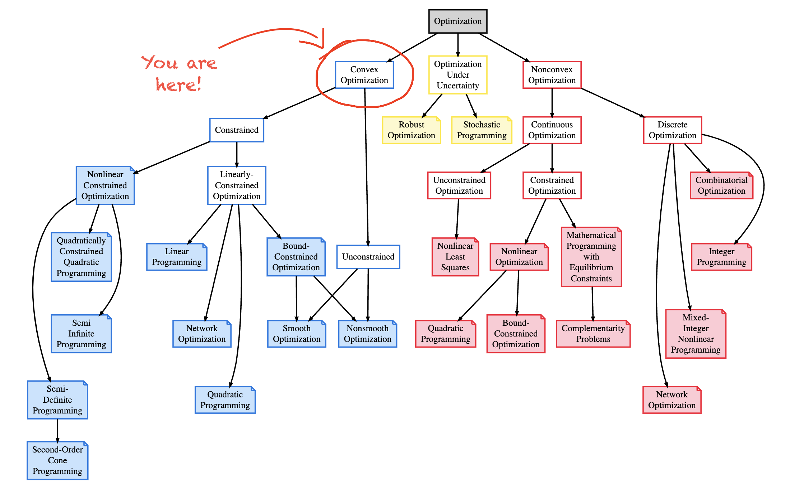

## Links
- ACM digital library: https://dl.acm.org/
- ACM Collected Algorithms: https://calgo.acm.org/
- IEEE Xplore: https://ieeexplore.ieee.org/Xplore/home.jsp

## Books and articles on convex optimization:

- GLL non-monotone line search algorithm: [L. Grippo, F. Lampariello and S. Lucidi, “A Nonmonotone Line Search Technique for Newton’s Methods,” SIAM Journal on Numerical Analysis, Vol. 23, No. 4, 1986, pp. 707-716.](https://epubs.siam.org/doi/10.1137/0723046)
- Hessian ill-conditioning hobbles first order methods (section 3.1): [Nicholas Vieau Alger (2019), "Data-Scalable Hessian Preconditioning for
Distributed Parameter PDE-Constrained Inverse Problems", PhD Thesis, University of Texas at Austin](https://repositories.lib.utexas.edu/server/api/core/bitstreams/95072b2e-e489-4026-b5b9-11ab4e12fdd7/content)
- Misc. on numerical optimization: [Boyd, S., & Vandenberghe, L. (2004). Convex optimization. Cambridge university press.](https://web.stanford.edu/~boyd/cvxbook/) (Chapter 9)
- Misc. on numerical optimization: [Nocedal, J., & Wright, S. J. (2006). Numerical optimization. Springer Science & Business Media.](https://www.math.uci.edu/~qnie/Publications/NumericalOptimization.pdf) 
- Misc. on numerical optimization:[Neculai Andrei, 2022. "Modern Numerical Nonlinear Optimization," Springer Optimization and Its Applications, Springer, number 978-3-031-08720-2, December](https://link.springer.com/book/10.1007/978-3-031-08720-2)
- Misc. on numerical optimization + cubic and quadratic interpolation: [Sun, Wenyu & Yuan, Ya-xiang. (2006). Optimization theory and methods. Nonlinear programming](https://bayanbox.ir/view/1460469776013846613/Sun-Yuan-Optimization-theory.pdf)
- Moré-Thuente line search algorithm: [Jorge J. Moré and David J. Thuente. 1994. Line search algorithms with guaranteed sufficient decrease. ACM Trans. Math. Softw. 20, 3 (Sept. 1994), 286–307.](https://www.ii.uib.no/~lennart/drgrad/More1994.pdf)
- NEOS Guide: [NEOS Guide](https://neos-guide.org/guide/algorithms/)
- Online scaling gradient methods (OSGM): [Gao, W., Chu, Y. C., Ye, Y., & Udell, M. (2024). Gradient Methods with Online Scaling. arXiv preprint arXiv:2411.01803](https://arxiv.org/pdf/2411.01803)
- Survey of existing solvers for bound-constrained optimization: [Tröltzsch, A. (2007). Benchmarking of bound-constrained optimization software](https://www.cerfacs.fr/algor/reports/2007/WN_PA_07_143.pdf) 
- Survey of existing solvers for bound-constrained optimization: [Birgin, E.G., Gentil, J.M. Evaluating bound-constrained minimization software. Comput Optim Appl 53, 347–373 (2012)](https://www.ime.usp.br/%7Eegbirgin/publications/bg-bdseval.pdf)
- Spectral Projected Gradient Method (ACM Algo 813): [Birgin, Ernesto & Martínez, José Mario & Raydan, Marcos. (2014). Spectral Projected Gradient Methods: Review and Perspectives. Journal of Statistical Software. 60. 1-21. 10.18637/jss.v060.i03.](https://www.ime.usp.br/~egbirgin/publications/bmr5.pdf)

## Nice community questions

- Preconditioning gradient descent: https://stats.stackexchange.com/questions/91862/preconditioning-gradient-descent
- Basic preconditioned gradient descent example: https://stats.stackexchange.com/questions/486594/basic-preconditioned-gradient-descent-example
- Relating condition number of hessian to the rate of convergence: https://math.stackexchange.com/questions/2285282/relating-condition-number-of-hessian-to-the-rate-of-convergence
- What is ill conditioning for a system of linear equations: https://www.quora.com/What-is-ill-conditioning-for-systems-of-linear-equations
- What is a ill conditioned matrix: https://www.quora.com/What-is-an-ill-conditioned-matrix
- What methods can be used for preconditioning of ill conditioned matrix: https://www.quora.com/What-methods-can-be-used-for-preconditioning-of-ill-conditioned-matrix 
-  Subtractive cancellation errors during computation: https://tobydriscoll.net/fnc-julia/intro/conditioning.html
- Painless conjugate gradient: https://www.cs.cmu.edu/~quake-papers/painless-conjugate-gradient.pdf
- A note on preconditioning: https://www.math.iit.edu/~fass/477577_Chapter_16.pdf

